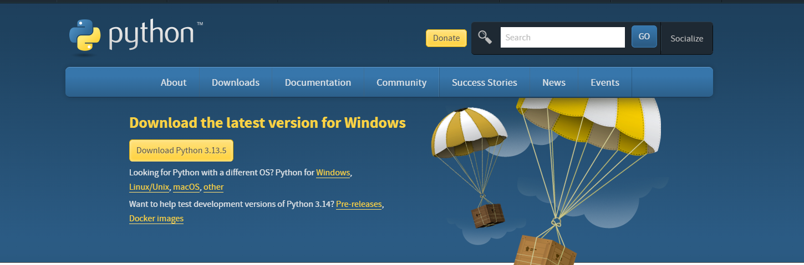
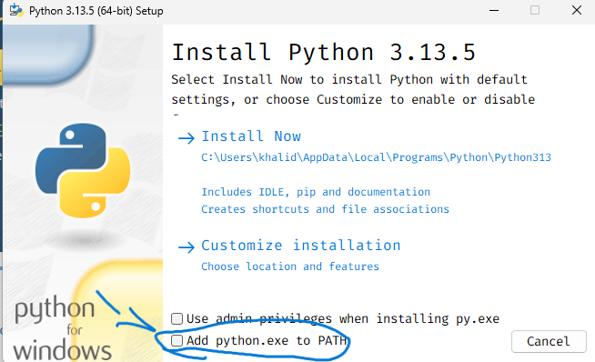
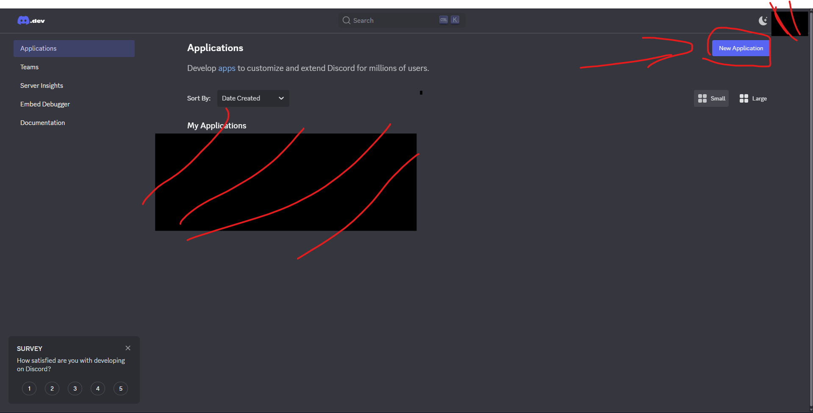
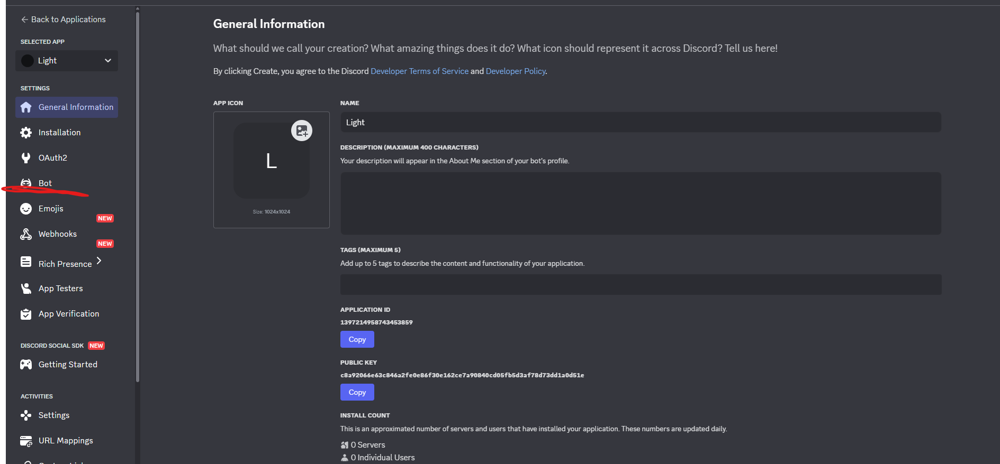
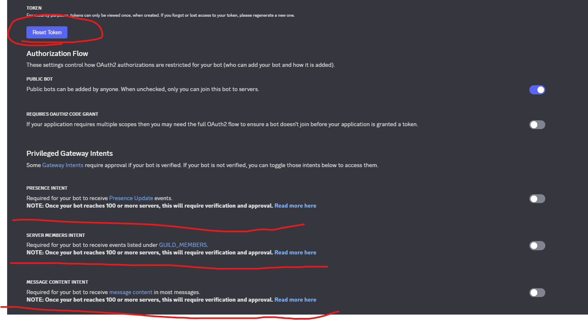
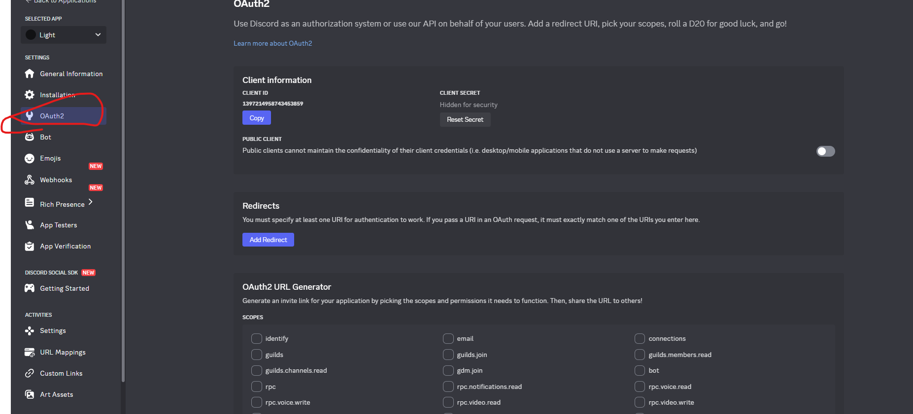
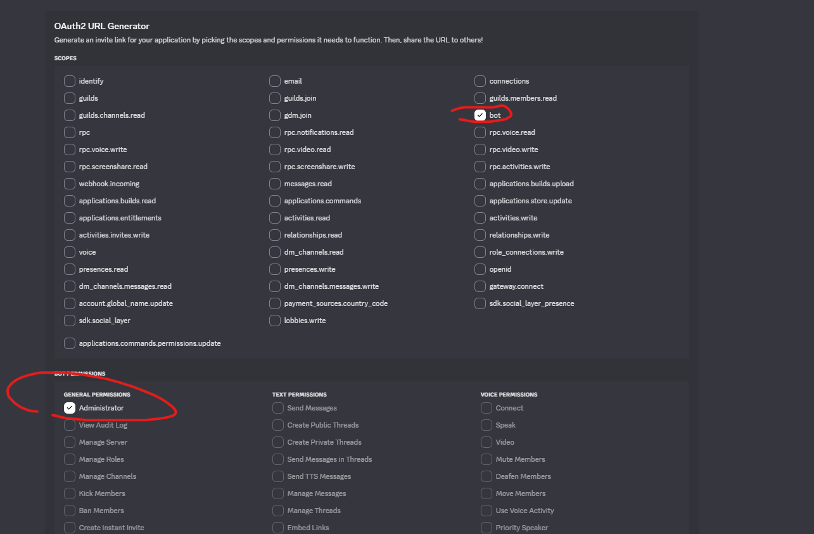
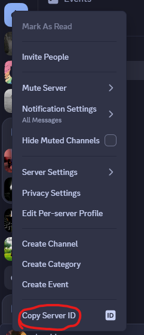
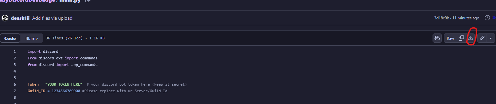
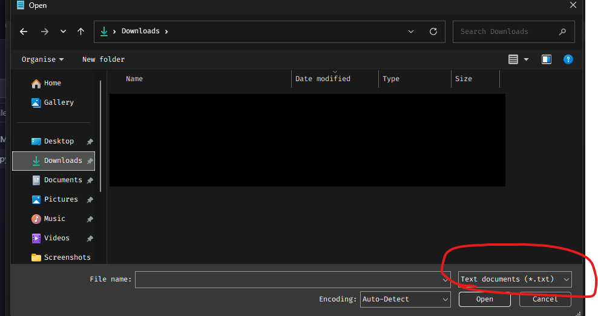

# EasyDiscordDevBadge

a super simple discord bot to help you get the **active developer badge** using slash commands.

> ⚠️ this does **not** work on mobile — but it works fine on any windows pc (even an old one)
> This is mostly foucsed for windows if you need help on linux(doubt that) or macos then just dm on discord @densh1ii

---

##  step 1: download python

go to the [python download page](https://www.python.org/downloads/) and click download:



---

## !!!!IMPORTANT!!!!

during installation, make sure to check **"add python.exe to PATH"**



---

##  step 2: create your discord bot

head to the [discord developer portal](https://discord.com/developers/applications), log in, and click **"new application"**



---

##  step 3: copy your token & give the bot the right permissions

go to the **bot** section:



then:

- click **reset token** and **copy** it (you’ll need this later — **never share it**)  
- scroll down and **enable these**:
  -  presence intent  
  -  server members intent  
  -  message content intent  



---

##  step 4: invite your bot to your server

go to the **OAuth2** tab:



scroll down, check the boxes like this:



then scroll to the bottom, copy the generated url, and paste it in your browser → invite the bot to your server.

---

##  step 5: get your server id & download the bot script

- go to **discord settings → advanced → turn on developer mode**
- right-click your server icon → **copy server id**



now download the bot file from here:  
[main.py](https://github.com/densh1ii/EasyDiscordDevBadge/blob/main/main.py)



---

##  step 6: edit the script & run the bot

1. go to where you downloaded `main.py` (probably your downloads folder)  
2. open **notepad**  
3. click **File → Open**, then switch to **All Files** at the bottom  
4. open `main.py`



inside the file, change:

- `Token = "..."` → paste your bot token  
- `Guild_ID = ...` → paste your server id (no quotes, just the number)


press **Ctrl + S** to save

---

### now run the bot

1. right-click an empty space in the folder  
2. click **“open in terminal”**  
3. run this command:

``` cmd 
py main.py
```

## bonus help
need help? dm me on discord: @densh1ii
if something breaks, double-check your token or server id — that’s usually the issue

note for linux/mac users:
this guide is written for windows. if you're on linux/mac, use python3 main.py instead of py main.py 
